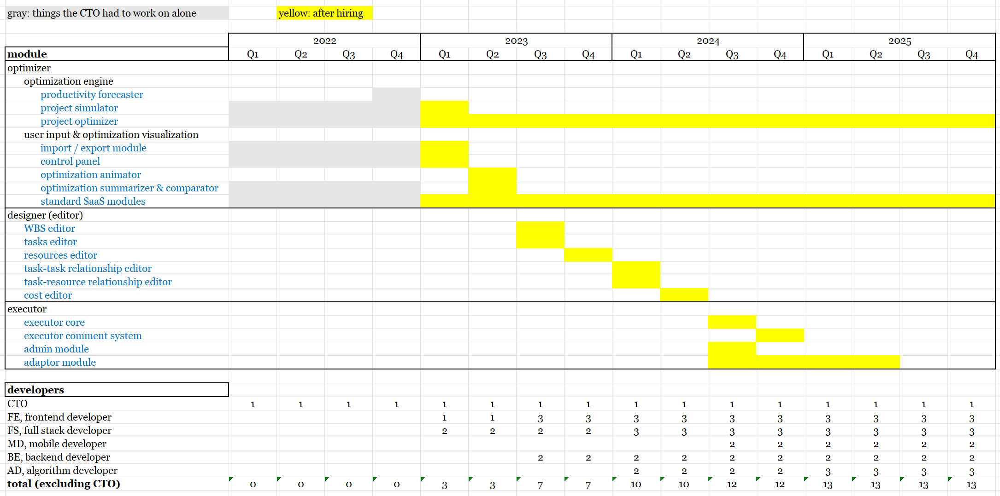

# Frontline's technical road map

**note**: 

- we will follow the modular design principle to keep the structure clear and extensible. In the following, all of the modules / submodules will be represented as a code block, i.e. `module 1`, `module 2`...

- we will use OP/MP to represent Oracle Primavera / Microsoft Project

# modules, statues, manpowers, timelines

## structure

# detailed explanations

## 1. `optimizer`

### `optimization engine`

- gets data via websocket from the frontend in Frontline's format defined by [Basic_Frontline_mathematics.pdf](https://github.com/Frontline-Industrial-Software/home/blob/main/Basic_Frontline_mathematics.pdf)

- `productivity forecaster`: computes a statistical average of the productivity for a certain type of resource based on tasks that are completed, and compute tasks properties that are not started based on these values
 
- `project simulator`: simulate the project given a certain set of optimization parameters and user configurations based on our *disentanglement algorithm*

- `project optimizer`: finds optimal parameters to generate many alternative project designs based on our *dynamical critical path algorithm* and its future improved versions

- sends back the alternative (optimised) project designs via websocket to the user in order to show an **animated optimization process**

### `user input & optimization visualisation`

- `import / export module`: import project files in OP/MP format, extract the information to convert it into our format and generate an optimization constraint template for the user to download. The exporter will be used to convert projects back to OP/MP format

- `control panel`: for the user to define global optimization parameters and upload the completed constraint template. Combines project data, control parameters and constraints into one object that is sent to the optimization engine

- `optimization animator`: receives the results from the optimization engine and show an animated optimization process (how the Gantt chart changes and how the resource distribution changes during optimization)

- `optimization summarizer & comparator`: generates graphs to visualise the optimization outcome. The user can select points in the plot and view comparisons between it and the original non-optimal design, the selected alternative project can be exported back into the user's original format

- `standard SaaS module`: this part contains features such as user login, user profile management, UI to create new projects etc.

## 2. `designer (editor)`

- we need a `project designer` like ones in OP/MP to make us an independent platform. The designer will be much simpler then OP/MP and only be based on our own maths model (optimization engine), which in turn focuses on the features that matter to our clients
    - `WBS editor`: work breakdown structure
    - `tasks editor`
    - `resources editor`
    - `task-task relationship editor`
    - `task-resource relationship editor`
    - `cost editor`

## 3. `executor`

**note**: the executor will be a mobile APP instead of web based like previous modules

- `executor core`: the core function of the executor is to allow live updates of project data to enable re-optimization of on-going projects. This is essentially the same as the designer but with a different UI that makes it more suitable for team collaboration

- `executor comment system`: this allows the team to communicate conveniently regarding problems for each task, each resource. It also serves as a record keeper for the real-life events encountered in carrying out the tasks. This gives us a social media like capability

- `admin module`: manages access and assign roles for manpowers related to the project

- `adaptor module`: communicates with `optimizer` and `designer (editor)`
