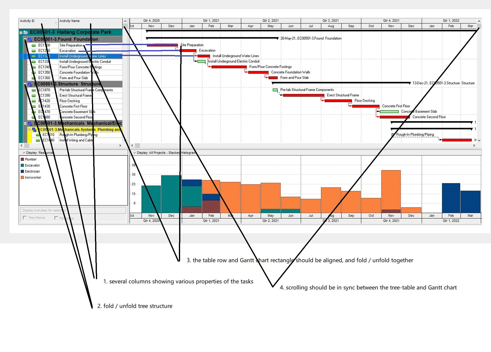
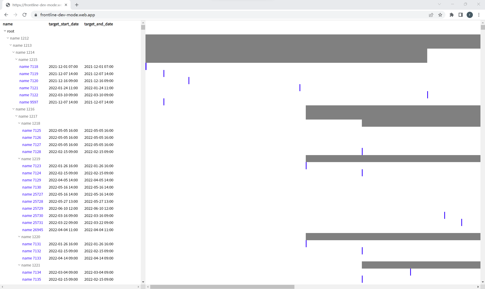

# Welcome to Frontline Industrial Software's GitHub repo!

*The main purpose of this repo is to attract strong talents to join our tech team! Keep reading for more information!*

- [website](https://www.frontlinec.com)
- [linkedin](https://www.linkedin.com/company/frontlinec)

## Introduction

Frontline builds mathematical models for construction projects and finds optimized project designs through high-performance simulations.

Mathematically, a construction project is composed of a large amount of **tasks** and the **dependency relationships** among them. Although the mathematical description of a single task is rather simple, the complexity arises when they form a large and complex network. This is quite similar to **Artificial Neural Networks** where single neurons are described by extremely simple activation functions, yet are capable of producing remarkable computational ability when forming a complex network with each other.

Practically, Frontline tries to automate the process of project optimization, which has been carried out manually by human project designers and usually takes them weeks of time when the project is large. 

Tools like [Oracle Primavera (released in 1983)](https://en.wikipedia.org/wiki/Primavera_(software)) and [Microsoft Project (released in 1984)](https://en.wikipedia.org/wiki/Microsoft_Project) are rather old softwares, and their purpose were to help project managers **designing** projects visually and easily, but it remained the human's duty to come up with **better** designs. 40 years later, Frontline tries to further reduce manual work by automating this optimization process as well.

## Basic mathematics

In a nutshell, we try to find better `duration` values for each task, with this and the `dependency relationships` we can determine and `start/end dates` of each task, we then can determine the `resource usage histogram` based on `duration, start/end dates`, with the `start/end dates` and `resource usage histogram` we can define various `loss functions` and use them to update the `duration` values.

For more details, see [Basic Frontline mathematics.pdf](./Basic_Frontline_mathematics.pdf) 

## We are hiring!

- We are looking for:
    - Frontend software engineer / intern
    - Fullstack software engineer / intern

Our CTO Ding Ruiqi, who has a background in theoretical physics and experiences with optimizing quantum systems, will be responsible for developing the core `optimization engine`. He will be providing the `optimization API` that receives non-optimal project data and sends back hundreds of alternative (optimized) project designs via websocket. 

However, an `engine` is far from a `car`. We need to hire software engineers to build complementary parts to the `engine` to make Frontline a B2B SaaS platform. Examples of these complementary parts are:

- A **project designer** like Oracle Primavera and Microsoft Project that enables user to design the initial **non-optimal** project, as well as enabling users to update the project information during **project execution**.
- A **platform integrator** that imports files from Oracle Primavera and Microsoft Project etc. and exports back to them.
- An **optimization controller** that allows users to define optimization constraints and objectives (loss functions) that will be sent to the `optimization engine`.
- An **optimization visualizer** that helps users to visualize and compare the optimization results produced by the `optimization engine`.
- **Standard B2B SaaS stuff**: user management, license management etc.

In summary, we are hiring people to build a pretty UI to get the best out of our `optimization engine`. An example UI looks like below (Oracle Primavera)



### Desired skills

- experience with building B2B SaaS platform
- experience with large scale & high speed data visualization
- experience with web based animation (we would like to animate the optimization process to the user)
- experience with building a web based *designer* (for example, circuit designer, 3d designer)
- strong at solving new problems, since what we are trying to build is non-standard and innovative
- ability to build things from scratch (so they can be highly customizable and optimized)

### We don't want

- experience with building e-commerce platforms, personal websites, blogs
- experience with glueing open source libraries together to make a giant Frankenstein

### We offer

- 4000 USD (and above, negotiable) salary based on position (fulltime/intern), experience and country. At least 1 month's salary as bonus
- standard insurances, annual health check
- remote working preferred
- 14 days annual leave, company trip to Singapore

## Frontline coding test

We value one's true ability much more than the experiences one claims to have. Therefore like most companies we use a test question to determine the candidate's true ability. However, we won't ask you to solve standard questions like string manipulation which we deem useless. We have prepared a custom real-world question instead.

In this test, you are given a `xer` file (oracle's format): [fake_project.xer](./fake_project.xer), you are expected to produce a webpage like the following to display the **project structure** and a [Gantt chart](https://en.wikipedia.org/wiki/Gantt_chart) using information from this file



You can view this demo webpage at [https://frontline-dev-mode.web.app](https://frontline-dev-mode.web.app). This page is created by the Ruiqi using less than **260 lines** of source code with **zero external dependencies** except for the standard React framework. Note that Ruiqi holds a degree in Physics, not Computer Science, he basically had to learn on the spot, therefore we expect the professional software developers we hire to be at least capable of the same.

Based on candidate feedback we have made the test into two difficulty levels:

1. Harder: Use [fake_project.xer](./fake_project.xer) and React framework alone, without any other external dependencies, to reproduce [https://frontline-dev-mode.web.app](https://frontline-dev-mode.web.app). (Again, Ruiqi has proven that this is doable with 260 lines of code)

2. Easier: Use [fake_project.xer](./fake_project.xer), the React framework and **one** external dependency (for example: [Go.js Gantt chart](https://gojs.net/latest/samples/gantt.html)) to reproduce [https://frontline-dev-mode.web.app](https://frontline-dev-mode.web.app)

### Hints

The main point of this test is *high speed display of large amount of data*. The [fake_project.xer](./fake_project.xer) above is a **19.2MB file with 19894 tasks and 28447 dependency relationships**. You will need techniques like `virtual rendering` to be able to display it without delay or page crash!

An `xer` file is simply a combination of several data tables, 
you can view the [documentation for xer format here](https://docs.oracle.com/cd/F51303_01/English/Mapping_and_Schema/xer_import_export_data_map_project/helpmain.htm?toc.htm?97890.htm).
For this test you only need to focus on two tables `PROJWBS` and `TASK`. You can use the following code to parse the xer file:

```javascript
function xer_to_json(xer=''){
  let proj = { tables: {} }, table, fields
  xer.split('\r\n').forEach(line=>{
    let rows = line.split('\t')
    let type = rows[0], items = rows.slice(1)
    switch(type){
      case 'ERMHDR': proj.header = items; break
      case '%T': table = proj.tables[rows[1]] = []; break
      case '%F': fields = items; break
      case '%R': table.push(to_dict(fields, items)); break
      default: break
    }
  })
  return proj
}

function to_dict(ks, vs){
  let dic = {}; ks.forEach((k,i)=> dic[k]=vs[i]); return dic
}
```

Once you have parsed the xer file into json structure, you can build a `tree` from it using

```javascript
function make_tree(proj){
  let { PROJWBS, TASK, PROJECT } = proj.tables
  let pid = PROJECT.find(p=>p.export_flag ==='Y').proj_id
  let wbs = {}
  PROJWBS.forEach(w=>{
    if(w.proj_id === pid) wbs[w.wbs_id] = Object.assign(w, {
      name: w.wbs_name, children: [], color: 'gray',
    })
  })

  let tree = {name: 'root', children: []}
  Object.values(wbs).forEach(w=>{
    let parent = wbs[w.parent_wbs_id] || tree
    parent.children.push(w)
  })
  TASK.forEach(t=>{
    if(t.proj_id === pid){
      let parent = wbs[t.wbs_id]
      parent.children.push(Object.assign(t, {
        name: t.task_name, children: [], color: 'blue',
      }))
    }
  })
  find_start_end(tree)
  return tree
}

function find_start_end(
  tree, ks = 'target_start_date', ke = 'target_end_date',
){
  function find_start(tree){
    if(tree.start){ }
    else if(tree[ks]) tree.start = Date.parse(tree[ks])
    else tree.start = Math.min(...tree.children.map(find_start))
    return tree.start
  }
  find_start(tree)
  function find_end(tree){
    if(tree.end){ }
    else if(tree[ke]) tree.end = Date.parse(tree[ke])
    else tree.end = Math.max(...tree.children.map(find_end))
    return tree.end
  }
  find_end(tree)
}
```

At this point you will get a `tree` structure, where each node has properties `name, children, color, start, end`. These are sufficient to reproduce [https://frontline-dev-mode.web.app](https://frontline-dev-mode.web.app).


If you are interested in this position, you are welcome to try out the test and drop us an email with title `Job application: your name`:
- Ding Ruiqi (CTO): ricky@frontlinec.com
- Luis Martinez (CEO): luis@frontlinec.com


